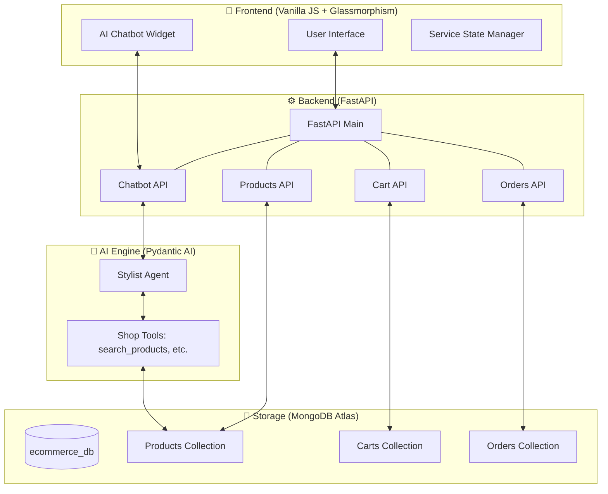
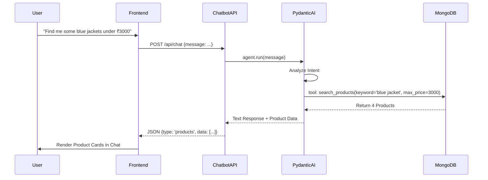

# 👕 LOOM & LUMEN - AI-Powered Premium E-Commerce ✦

[](https://fastapi.tiangolo.com/)
[](https://www.mongodb.com/atlas)
[](https://pydantic.ai/)
[](https://openai.com/)

Welcome to **LOOM & LUMEN**, a premium, high-end e-commerce experience driven by Agentic AI. This project showcases a sleek **Glassmorphism UI**, a high-performance **FastAPI Backend**, and an intelligent **Shopping Stylist** powered by **Pydantic AI**.

---

## 🏗️ System Architecture

Below is an interactive visualization of how the components of LOOM & LUMEN interact:



---

## ✨ Key Features

- **💎 Premium UI**: Modern dark-themed glassmorphism interface with smooth animations and responsive design.
- **🤖 AI Shopping Stylist**: An intelligent assistant that doesn't just search—it understands style, trends, and intent.
- **🛒 Persistent Cart**: Seamless session-based shopping cart handled via MongoDB.
- **📦 Massive Catalog**: Capable of handling hundreds of products with categorized filtering (Men, Women, Kids).
- **🔭 Deep Observability**: Integrated with **Pydantic Logfire** for full-stack tracing of API calls and AI tool execution.
- **🚀 One-Click Demo**: Built-in bulk generator to populate the store with hundreds of fashion items instantly.

---

## 🚦 Application Flow

How a user interacts with the AI Stylist:



---

## 🛠️ Technology Stack

| Layer | Technology |
| :--- | :--- |
| **Frontend** | Vanilla JavaScript, HTML5, CSS3 (Glassmorphism) |
| **API Framework** | FastAPI (Python 3.10+) |
| **AI Framework** | Pydantic AI (Agentic Orchestration) |
| **LLM Provider** | OpenAI (GPT-4o-mini) |
| **Database** | MongoDB Atlas (NoSQL) |
| **Observability** | Pydantic Logfire |

---

## 🚀 Getting Started

### 1. Configure Environment
Create a `.env` file in the root:
```env
MONGO_URI=your_mongodb_uri
OPENAI_API_KEY=your_openai_key
TAVILY_API_KEY=your_tavily_key
LOGFIRE_TOKEN=your_logfire_token
```

### 2. Install & Run
```bash
# Install dependencies
pip install -r requirements.txt

# Start the unified server
python main.py
```
The store will be live at `http://localhost:8000`.

---

## 🛣️ API Reference

| Endpoint | Method | Description |
| :--- | :--- | :--- |
| `/api/products` | `GET` | Fetch catalog with filters |
| `/api/chat` | `POST` | Interact with AI Stylist |
| `/api/cart/add` | `POST` | Add item to session cart |
| `/api/orders/checkout` | `POST` | Process final order |

---

## 📝 License
Distributed under the **MIT License**. Created by Google Deepmind Advanced Agentic Coding Team.